# BlogSpace — Frontend (Next.js + Tailwind)

A complete Blog Management frontend for the **Blog REST API** assignment.
Implements three visitor roles (Guest, User, Admin), authentication,
protected/role-based routing, blog CRUD, profile management, image upload,
admin user management, and responsive design.

---

## ✨ Features

### Guest
- Browse all blogs (homepage)
- Search blogs by title
- Filter blogs by category
- Combine search + category
- View a single blog post
- Register
- Login / Forgot / Reset password

### User
- Dashboard with stats
- My Blogs table (create / edit / delete with confirm dialog)
- Create / Edit blogs (frontend validation + API)
- Profile page (view + edit first/last name)
- Upload profile image (multipart) — reflected in navbar immediately
- Change password
- Logout

### Admin
- Everything a user can do
- View all blogs in the platform
- Edit / delete any blog
- Users page: list, view, activate/deactivate accounts
- Role-based route protection

---

## 🧱 Stack

- **Next.js 14** (App Router)
- **React 18**
- **Tailwind CSS 3**
- No backend dependencies — all data is fetched from the provided REST API.

---

## 📂 Project structure

```
blog-frontend/
├── app/
│   ├── layout.jsx
│   ├── page.jsx                       # Public homepage
│   ├── not-found.jsx
│   ├── blogs/[id]/page.jsx
│   ├── login/page.jsx
│   ├── register/page.jsx
│   ├── forgot-password/page.jsx
│   ├── reset-password/[token]/page.jsx
│   ├── dashboard/
│   │   ├── layout.jsx
│   │   ├── page.jsx                   # Dashboard home
│   │   ├── blogs/page.jsx             # My/All blogs table
│   │   ├── blogs/create/page.jsx
│   │   ├── blogs/[id]/edit/page.jsx
│   │   ├── profile/page.jsx
│   │   └── change-password/page.jsx
│   └── admin/
│       ├── layout.jsx
│       └── users/page.jsx
│
├── components/
│   ├── Avatar.jsx
│   ├── BlogCard.jsx
│   ├── BlogForm.jsx
│   ├── CategoryFilter.jsx
│   ├── ConfirmDialog.jsx
│   ├── DashboardLayoutShell.jsx
│   ├── EmptyState.jsx
│   ├── Footer.jsx
│   ├── Loader.jsx
│   ├── Navbar.jsx
│   ├── ProfileMenu.jsx
│   ├── Protected.jsx
│   ├── PublicNavbar.jsx
│   ├── SearchBar.jsx
│   └── Sidebar.jsx
│
├── contexts/
│   ├── AuthContext.jsx
│   └── ToastContext.jsx
│
├── services/
│   ├── auth.service.js
│   ├── blog.service.js
│   └── user.service.js
│
├── utils/
│   ├── api.js
│   ├── auth.js
│   ├── format.js
│   └── validators.js
│
├── package.json
├── next.config.mjs
├── tailwind.config.js
├── postcss.config.js
├── jsconfig.json
├── .env.example
└── .gitignore
```

---

## 🚀 Getting started

### 1. Prerequisites
- Node.js 18.17 or newer (Node 20+ recommended)
- The Blog REST API running on `http://localhost:5000`

### 2. Installation
Install dependencies:
```bash
npm install
```

### 3. Configure environment
Copy `.env.example` to `.env.local` and set the API base URL:
```
NEXT_PUBLIC_API_URL=http://localhost:5000/api
```

### 4. Run the development server
```bash
npm run dev
```
Visit [http://localhost:3000](http://localhost:3000).

### 5. Production build
```bash
npm run build
npm run start
```

---

## 🔌 Required backend APIs

All endpoints below are consumed exactly as documented by the Blog REST API
assignment. The frontend sends `Authorization: Bearer <token>` on every
authenticated request, and never sends `userId` (the backend determines the
user from the token).

### Auth
| Method | Endpoint                                | Used by |
| ------ | --------------------------------------- | ------- |
| POST   | `/api/auth/register`                    | Register page |
| POST   | `/api/auth/login`                       | Login page |
| POST   | `/api/auth/forgot-password`             | Forgot password |
| PATCH  | `/api/auth/reset-password/:token`       | Reset password page |

### Users
| Method | Endpoint                              | Used by |
| ------ | ------------------------------------- | ------- |
| GET    | `/api/users`                          | Admin users page |
| GET    | `/api/users/:id`                      | Admin user detail |
| PATCH  | `/api/users/:id/status`               | Admin activate/deactivate |
| GET    | `/api/users/profile`                  | Navbar avatar, dashboard, profile |
| PUT    | `/api/users/profile/update`           | Profile edit |
| PATCH  | `/api/users/profile/image` (multipart)| Profile image upload |
| PATCH  | `/api/users/password`                 | Change password |

### Blogs
| Method | Endpoint                              | Used by |
| ------ | ------------------------------------- | ------- |
| POST   | `/api/blogs/create`                   | Create blog |
| GET    | `/api/blogs?title=&category=`         | Homepage list + filter |
| GET    | `/api/blogs/:id`                      | Blog details, edit form |
| PUT    | `/api/blogs/update/:id`               | Edit blog |
| DELETE | `/api/blogs/delete/:id`               | Delete blog |

---

## 🧭 Routes

### Public
- `/` — Home (list, search, filter)
- `/blogs/[id]` — Blog details
- `/login`
- `/register`
- `/forgot-password`
- `/reset-password/[token]`

### Protected (any logged-in user)
- `/dashboard`
- `/dashboard/blogs`
- `/dashboard/blogs/create`
- `/dashboard/blogs/[id]/edit`
- `/dashboard/profile`
- `/dashboard/change-password`

### Admin-only
- `/admin/users`

Unauthenticated visitors hitting a protected route are redirected to
`/login`. Normal users hitting `/admin/*` are redirected to `/dashboard`.

---

## 🎨 Design notes

- All API access goes through `services/*` — pages never call `fetch` directly.
- Validation lives in `utils/validators.js` and runs before each request.
- Authentication state is persisted in `localStorage`; the app revalidates the
  token by calling `/users/profile` on mount. Invalid/expired tokens are
  cleared automatically.
- The navbar avatar updates immediately after a profile image upload — no
  re-login required.
- The sidebar becomes a drawer below the `lg` breakpoint.
- The list page uses a table for clarity; cards can be added without
  touching the rest of the app.

---

## 🧪 Scripts

```bash
npm run dev     # start dev server
npm run build   # production build
npm run start   # start production server
npm run lint    # run eslint
```

---

## 📸 Screenshots

| Page | File |
| --- | --- |
| Homepage | 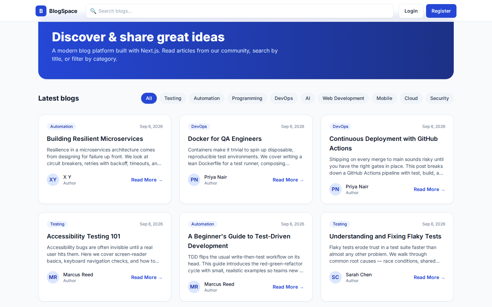 |
| Login | 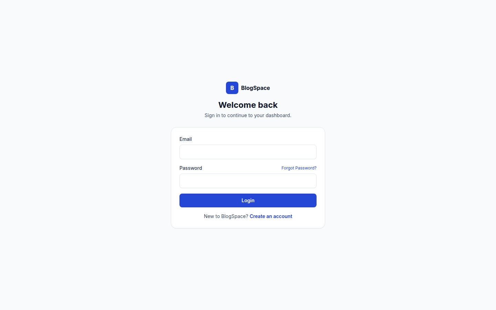 |
| Register | 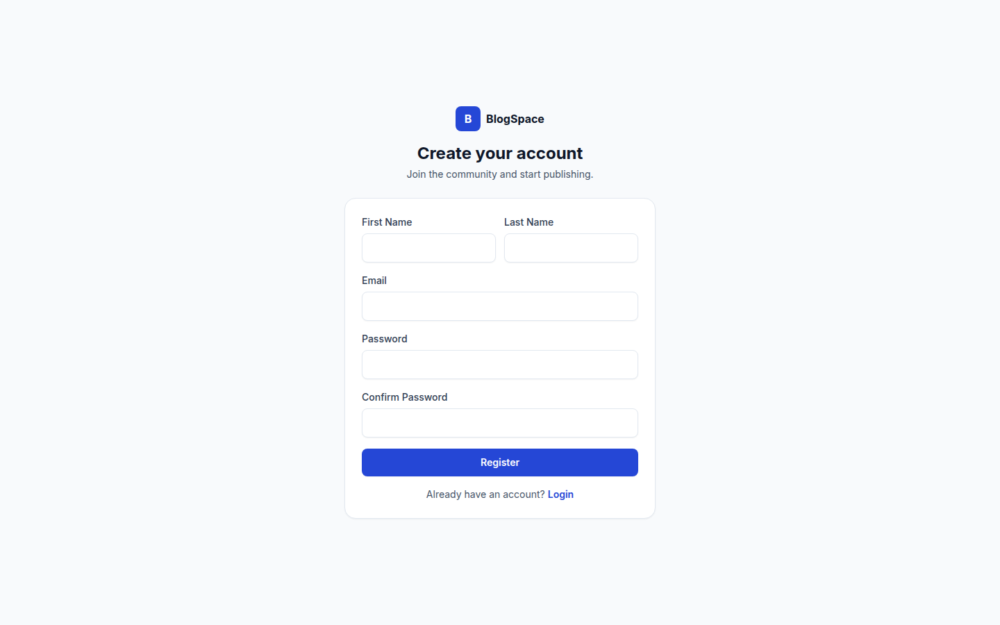 |
| Forgot Password | 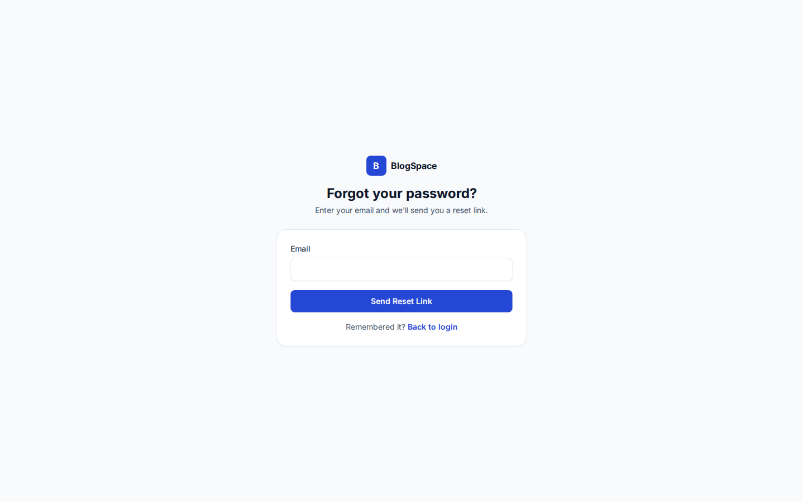 |
| Reset Password | 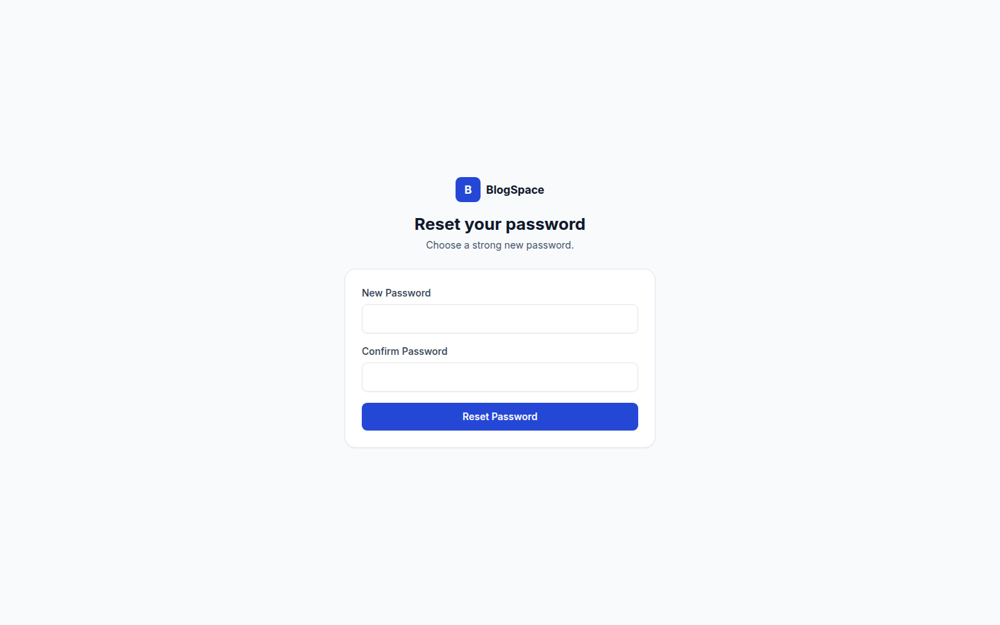 |
| Blog Details | 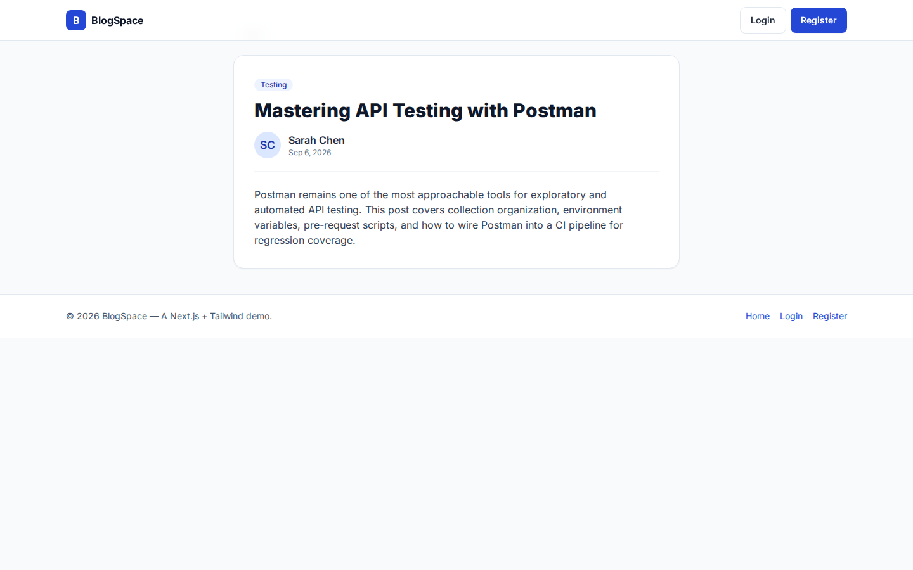 |
| Dashboard (User) | 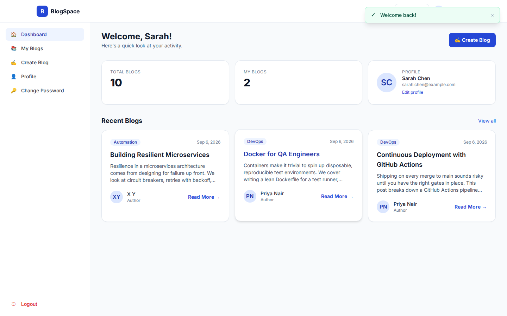 |
| Dashboard (Admin) | 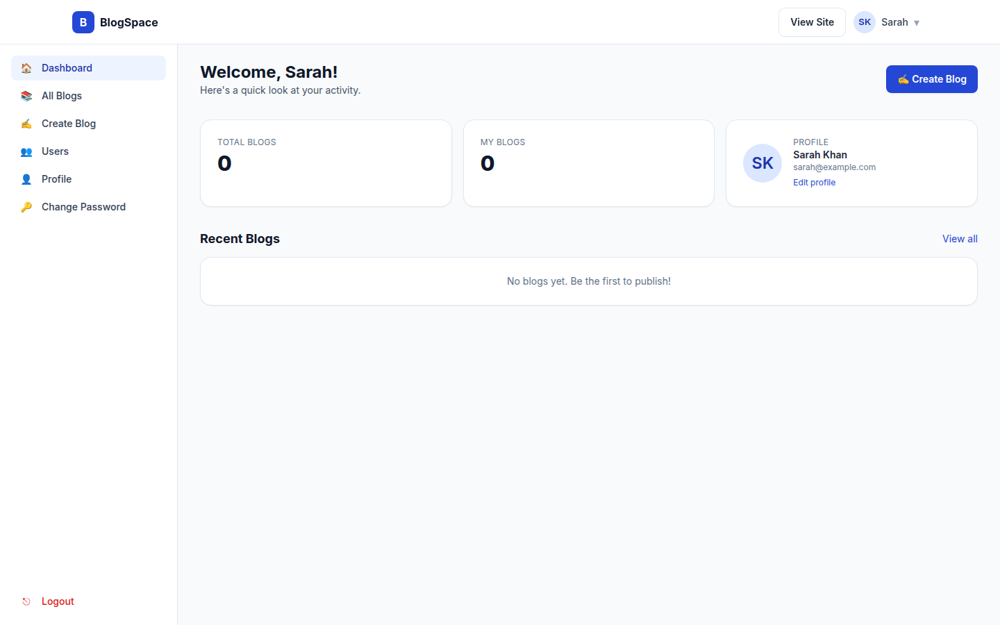 |
| My Blogs | 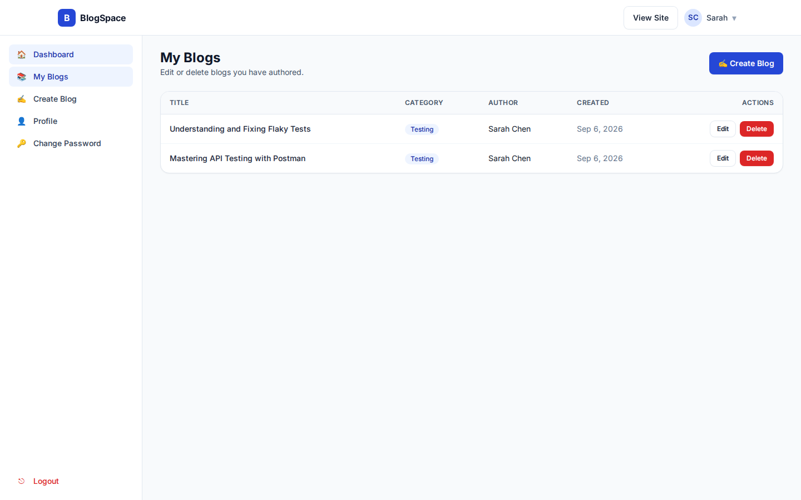 |
| All Blogs (Admin) | 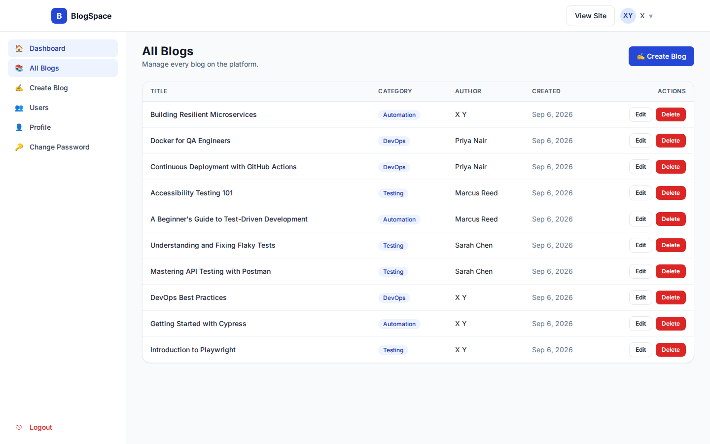 |
| Create Blog | 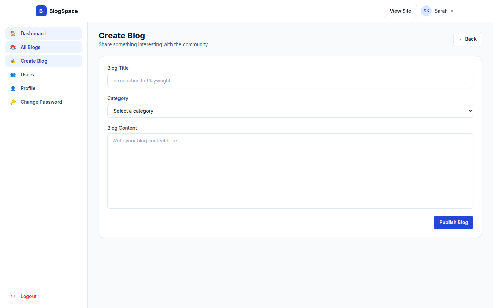 |
| Edit Blog | 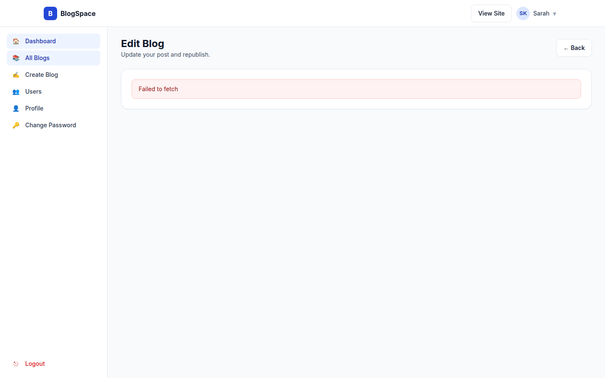 |
| Profile + Avatar upload | 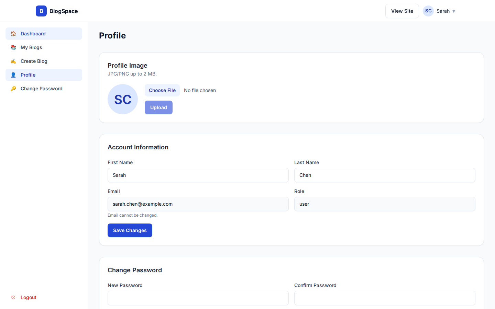 |
| Change Password | 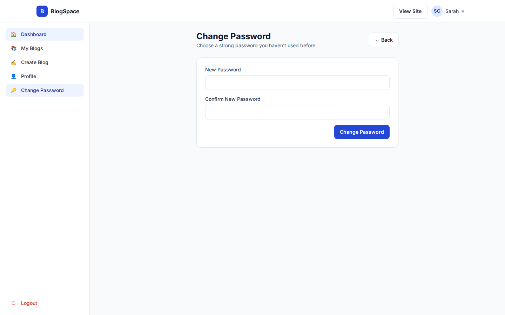 |
| Admin — Users | 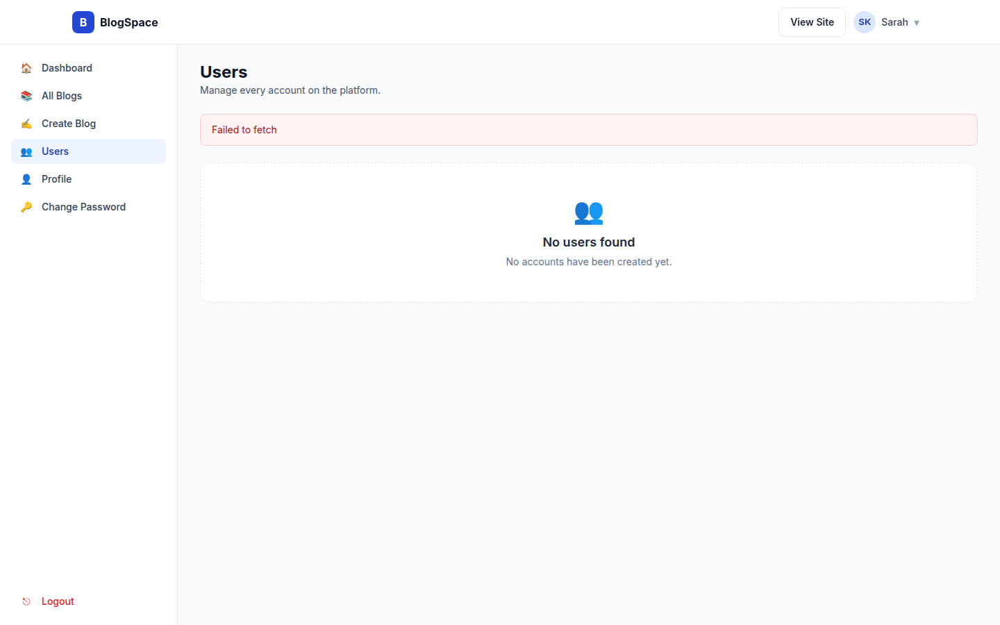 |

> Screenshots were captured with the frontend running against an offline
> environment (no backend reachable), which is why blog/user lists show the
> "Failed to fetch" empty state. With your Blog REST API running on
> `http://localhost:5000`, real data will populate the same UI.

---

## 📝 Submission checklist

- [x] Public GitHub repo
- [x] `.gitignore` (ignores `.env`, `node_modules`, `.next`)
- [x] `.env.example`
- [x] `README.md`
- [x] No hardcoded data — all from the REST API
- [x] No mock APIs
- [x] Frontend validation on every form
- [x] Backend errors are surfaced in toasts/banners
- [x] Loading + empty states everywhere
- [x] Responsive (mobile / tablet / desktop)